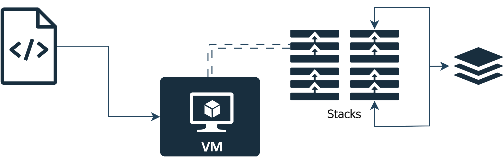

# valkyrie-vm

This is a stack based virtual machine used to run Valkyrie-Asm code.

## Getting Started 🚀

<!-- ### Pre-requisites 📋 -->

### Setting up 🔧

1. Clone the repo
   ```sh
   git clone https://github.com/daryedev/valkyrie-vm.git
   ```

<!-- ## Built with 🛠️ -->

## Arquitecture


*More information to be found at [DOCUMENTATION](./docs/DOCUMENTATION.md)*

## Authors ✒️

- [Eduardo Vieira de Goes Silva](https://github.com/BoolachA)
- [Francisco Martín Vélez Manrique](https://github.com/fram446742)
- [Josu Abad Otaño](https://github.com/josuabad)
- [Darío Pérez](https://github.com/DaryeDev)

## License 📄

This project is under the [GNU GPLv3](LICENSE) license.
